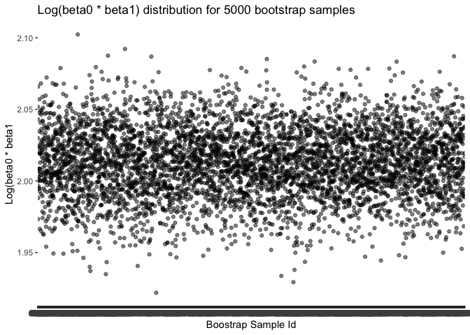

HW6
================
Serena (sjt2164)

This homework uses the `tidyverse` library with `set.set(1)` for
reproducibility.

## Problem 1

``` r
weather_df = 
  rnoaa::meteo_pull_monitors(
    c("USW00094728"),
    var = c("PRCP", "TMIN", "TMAX"), 
    date_min = "2017-01-01",
    date_max = "2017-12-31") %>%
  mutate(
    name = recode(id, USW00094728 = "CentralPark_NY"),
    tmin = tmin / 10,
    tmax = tmax / 10) %>%
  select(name, id, everything())
```

    ## using cached file: /Users/serenating/Library/Caches/org.R-project.R/R/rnoaa/noaa_ghcnd/USW00094728.dly

    ## date created (size, mb): 2024-10-27 21:40:52.853389 (8.656)

    ## file min/max dates: 1869-01-01 / 2024-10-31

``` r
#Central Park data for year 2017 with info on precipitation, max and min temp
```

- For each boostrap sample, interested in distribution of :
  - 𝑟̂ 2
  - log(𝛽̂ 0∗𝛽̂ 1)

``` r
Bootstrap = weather_df |> 
  modelr::bootstrap(n = 5000) |> #5000 bootstrap samples 
  mutate(
    models = map(strap, \(df) lm(tmax ~ tmin, data = df) ), # y = tmax, x = tmin
    results = map(models, broom::tidy), #for log betas
    r_squared = map(models, broom::glance)) |> #shows R^2
   # log_betas = log(intercept * 
  unnest(results, r_squared) |> 
  janitor::clean_names() |>
  select(id, term, estimate, r_squared) |>
   mutate(
    term = ifelse(term == "(Intercept)", "intercept", term)) |>
  pivot_wider(
    names_from = "term", 
    values_from = "estimate") |>
  mutate(
    log_beta0xbeta1 = log(intercept * tmin)) |> #log of the product of beta0 and beta1
  select(id, r_squared, log_beta0xbeta1)
```

    ## Warning: `unnest()` has a new interface. See `?unnest` for details.
    ## ℹ Try `df %>% unnest(c(results, r_squared))`, with `mutate()` if needed.

``` r
Bootstrap
```

    ## # A tibble: 5,000 × 3
    ##    id    r_squared log_beta0xbeta1
    ##    <chr>     <dbl>           <dbl>
    ##  1 0001      0.907            2.04
    ##  2 0002      0.896            2.03
    ##  3 0003      0.918            2.05
    ##  4 0004      0.899            2.07
    ##  5 0005      0.913            1.97
    ##  6 0006      0.919            1.99
    ##  7 0007      0.918            2.00
    ##  8 0008      0.907            2.00
    ##  9 0009      0.916            2.01
    ## 10 0010      0.918            2.02
    ## # ℹ 4,990 more rows

##### Distribution of 𝑟̂ 2 estimates

``` r
Bootstrap |>
  ggplot(aes(x = id, y = r_squared)) + 
  geom_point(alpha = 0.5) +
  stat_smooth(method = "lm") +
  labs(title = "R squared distribution for 5000 bootstrap samples",
       x = "Boostrap Sample Id",
       y = "R squared") 
```

    ## `geom_smooth()` using formula = 'y ~ x'

<!-- -->

##### Distribution of log(𝛽̂ 0∗𝛽̂ 1) estimates

``` r
Bootstrap |>
  ggplot(aes(x = id, y = log_beta0xbeta1)) + 
  geom_point(alpha = 0.5) +
  stat_smooth(method = "lm") +
  labs(title = "Log(beta0 * beta1) distribution for 5000 bootstrap samples",
       x = "Boostrap Sample Id",
       y = "Log(beta0 * beta1") 
```

    ## `geom_smooth()` using formula = 'y ~ x'

<!-- -->

Both plots indicate an uniformly distribution of the estimates. The
distribution of the R squared estimates has a higher density around 0.90
and 0.92. In comparison, the log(𝛽̂ 0∗𝛽̂ distribution is more concentrated
between 2.00 and 2.05.

##### Confidence Intervals

``` r
CI_estimates = Bootstrap |> 
  summarize(
    R2_ci_lower = quantile(r_squared, 0.025), 
    R2_ci_upper = quantile(r_squared, 0.975),
    logBetas_ci_lower = quantile(log_beta0xbeta1, 0.025), 
    logBetas_ci_upper = quantile(log_beta0xbeta1, 0.975)) 

CI_estimates
```

    ## # A tibble: 1 × 4
    ##   R2_ci_lower R2_ci_upper logBetas_ci_lower logBetas_ci_upper
    ##         <dbl>       <dbl>             <dbl>             <dbl>
    ## 1       0.894       0.927              1.96              2.06

Using the 5000 bootstrap estimates, we find that the 95% confidence
interval for 𝑟̂ 2 is (0.894, 0.927).

The 95% confidence interval for log(𝛽̂ 0∗𝛽̂ 1) is (1.964, 2.059).

## Problem 2: Homicides in 50 large U.S. cities

``` r
homicide = read_csv("./data/homicide-data.csv", na = c("NA", ".", "")) |>
  janitor::clean_names()
```

    ## Rows: 52179 Columns: 12
    ## ── Column specification ────────────────────────────────────────────────────────
    ## Delimiter: ","
    ## chr (9): uid, victim_last, victim_first, victim_race, victim_age, victim_sex...
    ## dbl (3): reported_date, lat, lon
    ## 
    ## ℹ Use `spec()` to retrieve the full column specification for this data.
    ## ℹ Specify the column types or set `show_col_types = FALSE` to quiet this message.

``` r
#52,179 observations and 12 variables
#victim_age has numeric values and some "unknown"

summary(homicide)
```

    ##      uid            reported_date       victim_last        victim_first      
    ##  Length:52179       Min.   : 20070101   Length:52179       Length:52179      
    ##  Class :character   1st Qu.: 20100318   Class :character   Class :character  
    ##  Mode  :character   Median : 20121216   Mode  :character   Mode  :character  
    ##                     Mean   : 20130899                                        
    ##                     3rd Qu.: 20150911                                        
    ##                     Max.   :201511105                                        
    ##                                                                              
    ##  victim_race         victim_age         victim_sex            city          
    ##  Length:52179       Length:52179       Length:52179       Length:52179      
    ##  Class :character   Class :character   Class :character   Class :character  
    ##  Mode  :character   Mode  :character   Mode  :character   Mode  :character  
    ##                                                                             
    ##                                                                             
    ##                                                                             
    ##                                                                             
    ##     state                lat             lon          disposition       
    ##  Length:52179       Min.   :25.73   Min.   :-122.51   Length:52179      
    ##  Class :character   1st Qu.:33.77   1st Qu.: -96.00   Class :character  
    ##  Mode  :character   Median :38.52   Median : -87.71   Mode  :character  
    ##                     Mean   :37.03   Mean   : -91.47                     
    ##                     3rd Qu.:40.03   3rd Qu.: -81.76                     
    ##                     Max.   :45.05   Max.   : -71.01                     
    ##                     NA's   :60      NA's   :60

``` r
#char = uid, victim_last, victim_first, victim_race, victim_age, victim_sex, city, state, and disposition
#dbl = reported_date, lat, lon

homicide |> distinct(victim_race) #Hispanic, White, Other, Black, Asian, and Unknown
```

    ## # A tibble: 6 × 1
    ##   victim_race
    ##   <chr>      
    ## 1 Hispanic   
    ## 2 White      
    ## 3 Other      
    ## 4 Black      
    ## 5 Asian      
    ## 6 Unknown

``` r
homicide |> distinct(victim_sex) #male, female, unknown
```

    ## # A tibble: 3 × 1
    ##   victim_sex
    ##   <chr>     
    ## 1 Male      
    ## 2 Female    
    ## 3 Unknown

``` r
homicide |> distinct(victim_age) #102 distinct ages, including unknown 
```

    ## # A tibble: 102 × 1
    ##    victim_age
    ##    <chr>     
    ##  1 78        
    ##  2 17        
    ##  3 15        
    ##  4 32        
    ##  5 72        
    ##  6 91        
    ##  7 52        
    ##  8 56        
    ##  9 43        
    ## 10 20        
    ## # ℹ 92 more rows

``` r
homicide |> distinct(city) #50
```

    ## # A tibble: 50 × 1
    ##    city       
    ##    <chr>      
    ##  1 Albuquerque
    ##  2 Atlanta    
    ##  3 Baltimore  
    ##  4 Baton Rouge
    ##  5 Birmingham 
    ##  6 Boston     
    ##  7 Buffalo    
    ##  8 Charlotte  
    ##  9 Chicago    
    ## 10 Cincinnati 
    ## # ℹ 40 more rows

``` r
homicide |> distinct(state) #28 states in abbrev. (wisconsin = "wI"?)
```

    ## # A tibble: 28 × 1
    ##    state
    ##    <chr>
    ##  1 NM   
    ##  2 GA   
    ##  3 MD   
    ##  4 LA   
    ##  5 AL   
    ##  6 MA   
    ##  7 NY   
    ##  8 NC   
    ##  9 IL   
    ## 10 OH   
    ## # ℹ 18 more rows

``` r
#unsolved homicides (those for which the disposition is “Closed without arrest” or “Open/No arrest”).

homicide |> count(disposition) #3 categories: closed without arrest (2922), closed by arrest (25674), open/no arrest (23583). Expect unsolved = 26505
```

    ## # A tibble: 3 × 2
    ##   disposition               n
    ##   <chr>                 <int>
    ## 1 Closed by arrest      25674
    ## 2 Closed without arrest  2922
    ## 3 Open/No arrest        23583

``` r
#sorting reported_date: 2 dates have an extra number (201511105, 201511018)
```

**Raw Data** The raw data `homicide` has 52179 observations and 12
variables.

- Identity variables include
  - `uid` (52179),
  - Name of victim (`victim_first` and `victim_last`)
  - `victim_race` (Hispanic, White, Other, Black, Asian, and Unknown),
  - `victim_age` (includes Unknown)
  - `victim_sex` (Male, Female, Unknown)
- Date variable includes `reported_date` in the format YYYYMMDD. 2
  entries does not follow this format (has an extra number).
- Location variables include `city` (50), `state`, latitude (`lat`), and
  longitude (`lon`).
- The last variable is `disposition` (3 categories)

**Data Cleaning**

- Fixed two `reported_date` entries that had an extra number
- Fixed abbreviation for Wisconsin
- created new `city_state` variable
- Created a `city_state` variable (e.g. “Baltimore, MD”)
- Created a binary variable `homicide_solved` indicating whether the
  homicide is solved (yes vs. no)
- Ensured `victim_age` is numeric
- Omited cities Dallas, TX; Phoenix, AZ; and Kansas City, MO (they don’t
  report victim race)
- Omited Tulsa, AL (is a data entry mistake)
- Limit your analysis to those for whom `victim_race` is `white` or
  `black`.

``` r
homicide_data = homicide |>
  mutate(
    reported_date = case_match(reported_date,
      201511105 ~ 20151105,
      201511018 ~ 20151018,
      .default = reported_date),
    reported_date = as.Date.character(reported_date, format = "%Y%m%d"),
     state = case_match(state,
      'wI' ~ 'WI',
      .default = state),
    victim_race = as.factor(victim_race),
    victim_sex = as.factor(victim_sex),
    victim_age = as.numeric(victim_age),
    city = as.factor(city),
    state = as.factor(state),
    disposition = as.factor(disposition)) |>
  mutate(
    city_state = paste(city, state, sep = ", "), #create city_state var
    homicide_solved = ifelse(disposition %in% c("Closed without arrest", "Open/No arrest"), 0, 1)) |> # 0 = unresolved, 1 = resolved
  filter(
    !city_state %in% c("Dallas, TX", "Phoenix, AZ", "Kansas City, MO", "Tulsa, AL"), #48507
    victim_race %in% c("White", "Black"))
```

    ## Warning: There was 1 warning in `mutate()`.
    ## ℹ In argument: `victim_age = as.numeric(victim_age)`.
    ## Caused by warning:
    ## ! NAs introduced by coercion

``` r
#Formatted date and checked so that:  
#GERALD A. BUNCH: 201511105 -> 20151105 -> 2015-11-05 
#LUIS SALAS: 201511018 -> 20151018 ->2015-10-18
#wisconsin = WI

#39693 observations
```

\_\**Baltimore, MD*

- For the city of Baltimore, MD, the `glm` function is used to fit a
  logistic regression with resolved vs unresolved as the outcome and
  victim age, sex and race as predictors.
  - Output of `glm` is saved as a csv file (Baltimore_glm.csv) and
    `broom::tidy` was applied to this object

``` r
baltimore_df = homicide_data |>
  filter(city_state == "Baltimore, MD") |>
  mutate(
    victim_race = fct_relevel(victim_race, "White"), #reference = White
    victim_sex = fct_relevel(victim_sex, "Male")) |>  #reference = Male
  select(homicide_solved, victim_age, victim_sex, victim_race)

fit_logistic = 
  baltimore_df |> 
  glm(homicide_solved ~ victim_age + victim_sex + victim_race , data = _, family = binomial()) 

glm_output = fit_logistic |> 
  broom::tidy() |> 
  mutate( 
    OR = exp(estimate), #obtain estimate
    CI_lower = exp(estimate - (1.96*std.error)) , #lower CI
    CI_upper = exp(estimate + (1.96*std.error)), #upper CI
    ) |>
  select(term, OR, CI_lower, CI_upper) |>
  knitr::kable(digits = 3)

 #output of glm saved as csv
print(glm_output)
```

    ## 
    ## 
    ## |term             |    OR| CI_lower| CI_upper|
    ## |:----------------|-----:|--------:|--------:|
    ## |(Intercept)      | 1.346|    0.888|    2.041|
    ## |victim_age       | 0.993|    0.987|    1.000|
    ## |victim_sexFemale | 2.350|    1.793|    3.081|
    ## |victim_raceBlack | 0.431|    0.306|    0.607|

``` r
write.csv(glm_output, "Baltimore_glm.csv")

#95% CI = estimate ± (critical value * standard error)
```

**MODEL**

homicide_solved = -0.007(victim_age) + 0.854(victim_sexFemale) -
0.842(victim_raceBlack) + 0.297

Reference = Male, White

Comparing solved vs. unsolved homicides

Based on the output, the OR estimate and its 95% confidence interval for
solving homicides comparing male victims to female victims keeping all
other variables fixed.

``` r
# homicide_solved = 1 = solved
```

*Glm for the Cities*

- Now run glm for each of the cities in your dataset
- Extract the adjusted odds ratio (and CI) for solving homicides
  comparing male victims to female victims.
- Do this within a “tidy” pipeline, making use of `purrr::map`, list
  columns, and `unnest` as necessary to create a dataframe with
  estimated ORs and CIs for each city.

*Plot*

- Shows the estimated ORs and CIs for each city on plot
- Organize cities according to estimated OR
- Comment on the plot

## Problem 3: Effects of variables on a child’s birthweight

``` r
bwt_df = read_csv("./data/birthweight.csv", na = c("NA", ".", ""))
```

    ## Rows: 4342 Columns: 20
    ## ── Column specification ────────────────────────────────────────────────────────
    ## Delimiter: ","
    ## dbl (20): babysex, bhead, blength, bwt, delwt, fincome, frace, gaweeks, malf...
    ## 
    ## ℹ Use `spec()` to retrieve the full column specification for this data.
    ## ℹ Specify the column types or set `show_col_types = FALSE` to quiet this message.

``` r
#4342 observations, 20 variables
```

Dataset has ~4000 children and includes the following variables:

- `babysex`: baby’s sex (male = 1, female = 2)
- `bhead`: baby’s head circumference at birth (centimeters)
- `blength`: baby’s length at birth (centimeteres)
- `bwt`: baby’s birth weight (grams)
- `delwt`: mother’s weight at delivery (pounds)
- `fincome`: family monthly income (in hundreds, rounded)
- `frace`: father’s race (1 = White, 2 = Black, 3 = Asian, 4 = Puerto
  Rican, 8 = Other, 9 = Unknown)
- `gaweeks`: gestational age in weeks
- `malform`: presence of malformations that could affect weight (0 =
  absent, 1 = present)
- `menarche`: mother’s age at menarche (years)
- `mheigth`: mother’s height (inches)
- `momage`: mother’s age at delivery (years)
- `mrace`: mother’s race (1 = White, 2 = Black, 3 = Asian, 4 = Puerto
  Rican, 8 = Other)
- `parity`: number of live births prior to this pregnancy
- `pnumlbw`: previous number of low birth weight babies
- `pnumgsa`: number of prior small for gestational age babies
- `ppbmi`: mother’s pre-pregnancy BMI
- `ppwt`: mother’s pre-pregnancy weight (pounds)
- `smoken`: average number of cigarettes smoked per day during pregnancy
- wtgain\`: mother’s weight gain during pregnancy (pounds)

#### Data Cleaning

``` r
#clean the data for regression analysis (i.e. convert numeric to factor where appropriate, check for missing data, etc.).
```

#### Regression Model

Propose a regression model for birthweight. \* Model may be based on a
hypothesized structure for the factors that underly birthweight, on a
data-driven model-building process, or a combination of the two. \*
Describe modeling process

- Show a plot of model residuals against fitted values – use
  `add_predictions` and `add_residuals` in making this plot.

#### Compare your model to two others:

- One using length at birth and gestational age as predictors (main
  effects only)

- One using head circumference, length, sex, and all interactions
  (including the three-way interaction) between these

Make this comparison in terms of the cross-validated prediction error;
use `crossv_mc` and functions in `purrr` as appropriate.

Note that although we expect your model to be reasonable, model building
itself is not a main idea of the course and we don’t necessarily expect
your model to be “optimal”.
