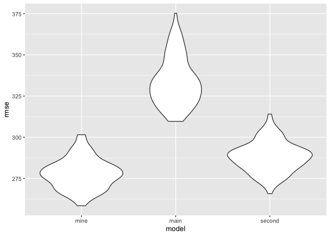

HW6
================
Serena (sjt2164)

This homework uses the `tidyverse` library with `set.set(1)` for
reproducibility.

## Problem 1

``` r
weather_df = 
  rnoaa::meteo_pull_monitors(
    c("USW00094728"),
    var = c("PRCP", "TMIN", "TMAX"), 
    date_min = "2017-01-01",
    date_max = "2017-12-31") %>%
  mutate(
    name = recode(id, USW00094728 = "CentralPark_NY"),
    tmin = tmin / 10,
    tmax = tmax / 10) %>%
  select(name, id, everything())
```

    ## using cached file: /Users/serenating/Library/Caches/org.R-project.R/R/rnoaa/noaa_ghcnd/USW00094728.dly

    ## date created (size, mb): 2024-10-27 21:40:52.853389 (8.656)

    ## file min/max dates: 1869-01-01 / 2024-10-31

``` r
#Central Park data for year 2017 with info on precipitation, max and min temp
```

- For each boostrap sample, interested in distribution of :
  - 𝑟̂ 2
  - log(𝛽̂ 0∗𝛽̂ 1)

``` r
Bootstrap = weather_df |> 
  modelr::bootstrap(n = 5000) |> #5000 bootstrap samples 
  mutate(
    models = map(strap, \(df) lm(tmax ~ tmin, data = df) ), # y = tmax, x = tmin
    results = map(models, broom::tidy), #for log betas
    r_squared = map(models, broom::glance)) |> #shows R^2
   # log_betas = log(intercept * 
  unnest(results, r_squared) |> 
  janitor::clean_names() |>
  select(id, term, estimate, r_squared) |>
   mutate(
    term = ifelse(term == "(Intercept)", "intercept", term)) |>
  pivot_wider(
    names_from = "term", 
    values_from = "estimate") |>
  mutate(
    log_beta0xbeta1 = log(intercept * tmin)) |> #log of the product of beta0 and beta1
  select(id, r_squared, log_beta0xbeta1)
```

    ## Warning: `unnest()` has a new interface. See `?unnest` for details.
    ## ℹ Try `df %>% unnest(c(results, r_squared))`, with `mutate()` if needed.

``` r
Bootstrap
```

    ## # A tibble: 5,000 × 3
    ##    id    r_squared log_beta0xbeta1
    ##    <chr>     <dbl>           <dbl>
    ##  1 0001      0.907            2.04
    ##  2 0002      0.896            2.03
    ##  3 0003      0.918            2.05
    ##  4 0004      0.899            2.07
    ##  5 0005      0.913            1.97
    ##  6 0006      0.919            1.99
    ##  7 0007      0.918            2.00
    ##  8 0008      0.907            2.00
    ##  9 0009      0.916            2.01
    ## 10 0010      0.918            2.02
    ## # ℹ 4,990 more rows

##### Distribution of 𝑟̂ 2 estimates

``` r
Bootstrap |>
  ggplot(aes(x = id, y = r_squared)) + 
  geom_point(alpha = 0.5) +
  stat_smooth(method = "lm") +
  labs(title = "R squared distribution for 5000 bootstrap samples",
       x = "Boostrap Sample Id",
       y = "R squared") 
```

    ## `geom_smooth()` using formula = 'y ~ x'

<!-- -->

##### Distribution of log(𝛽̂ 0∗𝛽̂ 1) estimates

``` r
Bootstrap |>
  ggplot(aes(x = id, y = log_beta0xbeta1)) + 
  geom_point(alpha = 0.5) +
  stat_smooth(method = "lm") +
  labs(title = "Log(beta0 * beta1) distribution for 5000 bootstrap samples",
       x = "Boostrap Sample Id",
       y = "Log(beta0 * beta1") 
```

    ## `geom_smooth()` using formula = 'y ~ x'

<!-- -->

Both plots indicate an uniformly distribution of the estimates. The
distribution of the R squared estimates has a higher density around 0.90
and 0.92. In comparison, the log(𝛽̂ 0∗𝛽̂ distribution is more concentrated
between 2.00 and 2.05.

##### Confidence Intervals

``` r
CI_estimates = Bootstrap |> 
  summarize(
    R2_ci_lower = quantile(r_squared, 0.025), 
    R2_ci_upper = quantile(r_squared, 0.975),
    logBetas_ci_lower = quantile(log_beta0xbeta1, 0.025), 
    logBetas_ci_upper = quantile(log_beta0xbeta1, 0.975)) 

CI_estimates
```

    ## # A tibble: 1 × 4
    ##   R2_ci_lower R2_ci_upper logBetas_ci_lower logBetas_ci_upper
    ##         <dbl>       <dbl>             <dbl>             <dbl>
    ## 1       0.894       0.927              1.96              2.06

Using the 5000 bootstrap estimates, we find that the 95% confidence
interval for 𝑟̂ 2 is (0.894, 0.927).

The 95% confidence interval for log(𝛽̂ 0∗𝛽̂ 1) is (1.964, 2.059).

## Problem 2: Homicides in 50 large U.S. cities

``` r
homicide = read_csv("./data/homicide-data.csv", na = c("NA", ".", "")) |>
  janitor::clean_names()
```

    ## Rows: 52179 Columns: 12
    ## ── Column specification ────────────────────────────────────────────────────────
    ## Delimiter: ","
    ## chr (9): uid, victim_last, victim_first, victim_race, victim_age, victim_sex...
    ## dbl (3): reported_date, lat, lon
    ## 
    ## ℹ Use `spec()` to retrieve the full column specification for this data.
    ## ℹ Specify the column types or set `show_col_types = FALSE` to quiet this message.

``` r
#52,179 observations and 12 variables
#victim_age has numeric values and some "unknown"

summary(homicide)
```

    ##      uid            reported_date       victim_last        victim_first      
    ##  Length:52179       Min.   : 20070101   Length:52179       Length:52179      
    ##  Class :character   1st Qu.: 20100318   Class :character   Class :character  
    ##  Mode  :character   Median : 20121216   Mode  :character   Mode  :character  
    ##                     Mean   : 20130899                                        
    ##                     3rd Qu.: 20150911                                        
    ##                     Max.   :201511105                                        
    ##                                                                              
    ##  victim_race         victim_age         victim_sex            city          
    ##  Length:52179       Length:52179       Length:52179       Length:52179      
    ##  Class :character   Class :character   Class :character   Class :character  
    ##  Mode  :character   Mode  :character   Mode  :character   Mode  :character  
    ##                                                                             
    ##                                                                             
    ##                                                                             
    ##                                                                             
    ##     state                lat             lon          disposition       
    ##  Length:52179       Min.   :25.73   Min.   :-122.51   Length:52179      
    ##  Class :character   1st Qu.:33.77   1st Qu.: -96.00   Class :character  
    ##  Mode  :character   Median :38.52   Median : -87.71   Mode  :character  
    ##                     Mean   :37.03   Mean   : -91.47                     
    ##                     3rd Qu.:40.03   3rd Qu.: -81.76                     
    ##                     Max.   :45.05   Max.   : -71.01                     
    ##                     NA's   :60      NA's   :60

``` r
#char = uid, victim_last, victim_first, victim_race, victim_age, victim_sex, city, state, and disposition
#dbl = reported_date, lat, lon

homicide |> distinct(victim_race) #Hispanic, White, Other, Black, Asian, and Unknown
```

    ## # A tibble: 6 × 1
    ##   victim_race
    ##   <chr>      
    ## 1 Hispanic   
    ## 2 White      
    ## 3 Other      
    ## 4 Black      
    ## 5 Asian      
    ## 6 Unknown

``` r
homicide |> distinct(victim_sex) #male, female, unknown
```

    ## # A tibble: 3 × 1
    ##   victim_sex
    ##   <chr>     
    ## 1 Male      
    ## 2 Female    
    ## 3 Unknown

``` r
homicide |> distinct(victim_age) #102 distinct ages, including unknown 
```

    ## # A tibble: 102 × 1
    ##    victim_age
    ##    <chr>     
    ##  1 78        
    ##  2 17        
    ##  3 15        
    ##  4 32        
    ##  5 72        
    ##  6 91        
    ##  7 52        
    ##  8 56        
    ##  9 43        
    ## 10 20        
    ## # ℹ 92 more rows

``` r
homicide |> distinct(city) #50
```

    ## # A tibble: 50 × 1
    ##    city       
    ##    <chr>      
    ##  1 Albuquerque
    ##  2 Atlanta    
    ##  3 Baltimore  
    ##  4 Baton Rouge
    ##  5 Birmingham 
    ##  6 Boston     
    ##  7 Buffalo    
    ##  8 Charlotte  
    ##  9 Chicago    
    ## 10 Cincinnati 
    ## # ℹ 40 more rows

``` r
homicide |> distinct(state) #28 states in abbrev. (wisconsin = "wI"?)
```

    ## # A tibble: 28 × 1
    ##    state
    ##    <chr>
    ##  1 NM   
    ##  2 GA   
    ##  3 MD   
    ##  4 LA   
    ##  5 AL   
    ##  6 MA   
    ##  7 NY   
    ##  8 NC   
    ##  9 IL   
    ## 10 OH   
    ## # ℹ 18 more rows

``` r
#unsolved homicides (those for which the disposition is “Closed without arrest” or “Open/No arrest”).

homicide |> count(disposition) #3 categories: closed without arrest (2922), closed by arrest (25674), open/no arrest (23583). Expect unsolved = 26505
```

    ## # A tibble: 3 × 2
    ##   disposition               n
    ##   <chr>                 <int>
    ## 1 Closed by arrest      25674
    ## 2 Closed without arrest  2922
    ## 3 Open/No arrest        23583

``` r
#sorting reported_date: 2 dates have an extra number (201511105, 201511018)
```

**Raw Data** The raw data `homicide` has 52179 observations and 12
variables.

- Identity variables include
  - `uid` (52179),
  - Name of victim (`victim_first` and `victim_last`)
  - `victim_race` (Hispanic, White, Other, Black, Asian, and Unknown),
  - `victim_age` (includes Unknown)
  - `victim_sex` (Male, Female, Unknown)
- Date variable includes `reported_date` in the format YYYYMMDD. 2
  entries does not follow this format (has an extra number).
- Location variables include `city` (50), `state`, latitude (`lat`), and
  longitude (`lon`).
- The last variable is `disposition` (3 categories)

**Data Cleaning**

- Fixed two `reported_date` entries that had an extra number
- Fixed abbreviation for Wisconsin
- created new `city_state` variable
- Created a `city_state` variable (e.g. “Baltimore, MD”)
- Created a binary variable `homicide_solved` indicating whether the
  homicide is solved (yes vs. no)
- Ensured `victim_age` is numeric
- Omited cities Dallas, TX; Phoenix, AZ; and Kansas City, MO (they don’t
  report victim race)
- Omited Tulsa, AL (is a data entry mistake)
- Limit your analysis to those for whom `victim_race` is `white` or
  `black`.

``` r
homicide_data = homicide |>
  mutate(
    reported_date = case_match(reported_date,
      201511105 ~ 20151105,
      201511018 ~ 20151018,
      .default = reported_date),
    reported_date = as.Date.character(reported_date, format = "%Y%m%d"),
     state = case_match(state,
      'wI' ~ 'WI',
      .default = state),
    victim_race = as.factor(victim_race),
    victim_sex = as.factor(victim_sex),
    victim_age = as.numeric(victim_age),
    city = as.factor(city),
    state = as.factor(state),
    disposition = as.factor(disposition)) |>
  mutate(
    city_state = paste(city, state, sep = ", "), #create city_state var
    homicide_solved = ifelse(disposition %in% c("Closed without arrest", "Open/No arrest"), 0, 1)) |> # 0 = unresolved, 1 = resolved
  filter(
    !city_state %in% c("Dallas, TX", "Phoenix, AZ", "Kansas City, MO", "Tulsa, AL"), #48507
    victim_race %in% c("White", "Black"))
```

    ## Warning: There was 1 warning in `mutate()`.
    ## ℹ In argument: `victim_age = as.numeric(victim_age)`.
    ## Caused by warning:
    ## ! NAs introduced by coercion

``` r
#Formatted date and checked so that:  
#GERALD A. BUNCH: 201511105 -> 20151105 -> 2015-11-05 
#LUIS SALAS: 201511018 -> 20151018 ->2015-10-18
#wisconsin = WI

#39693 observations
```

\_\**Baltimore, MD*

- For the city of Baltimore, MD, the `glm` function is used to fit a
  logistic regression with resolved vs unresolved as the outcome and
  victim age, sex and race as predictors.
  - Output of `glm` is saved as a csv file (Baltimore_glm.csv) and
    `broom::tidy` was applied to this object

``` r
baltimore_df = homicide_data |>
  filter(city_state == "Baltimore, MD") |>
  mutate(
    victim_race = fct_relevel(victim_race, "White"), #reference = White
    victim_sex = fct_relevel(victim_sex, "Male")) |>  #reference = Male
  select(homicide_solved, victim_age, victim_sex, victim_race)

fit_logistic = 
  baltimore_df |> 
  glm(homicide_solved ~ victim_age + victim_sex + victim_race , data = _, family = binomial()) 

glm_output = fit_logistic |> 
  broom::tidy() |> 
  mutate( 
    OR = exp(estimate), #obtain estimate
    CI_lower = exp(estimate - (1.96*std.error)) , #lower CI
    CI_upper = exp(estimate + (1.96*std.error)), #upper CI
    ) |>
  select(term, OR, CI_lower, CI_upper) |>
  knitr::kable(digits = 3)

 #output of glm saved as csv
print(glm_output)
```

    ## 
    ## 
    ## |term             |    OR| CI_lower| CI_upper|
    ## |:----------------|-----:|--------:|--------:|
    ## |(Intercept)      | 1.346|    0.888|    2.041|
    ## |victim_age       | 0.993|    0.987|    1.000|
    ## |victim_sexFemale | 2.350|    1.793|    3.081|
    ## |victim_raceBlack | 0.431|    0.306|    0.607|

``` r
write.csv(glm_output, "Baltimore_glm.csv")

#95% CI = estimate ± (critical value * standard error)
```

**Solving homicides comparing male victims to female victims keeping all
other variables fixed**

Based on the output, the OR estimate for solved homicides comparing
female vs. male is 2.35 and its 95% confidence interval is (1.793,
3.081), adjusting for age and race.

The odds of solving homicides for females is 2.35 times higher than the
odds of solving homicides for males. We are 95% confident that the true
odds of solving homicides comparing males to females is between 1.793
and 3.081. (Reference = Male, White)

*Glm for the Cities*

``` r
homicide_data |> count(victim_sex) #41 unknown sex
```

    ## # A tibble: 3 × 2
    ##   victim_sex     n
    ##   <fct>      <int>
    ## 1 Female      5903
    ## 2 Male       33749
    ## 3 Unknown       41

``` r
#set reference = White and Male
city_df = homicide_data |>
  filter(
    victim_sex %in% c("Male", "Female")) |> #keep only male and female
  mutate(
    victim_race = fct_relevel(victim_race, "White"), 
    victim_sex = fct_relevel(victim_sex, "Male")) |>
  select(city_state, homicide_solved, victim_age, victim_sex, victim_race) |>
    group_by(city_state) |>
  nest() |>
  mutate(
    city_model = map(data, ~glm(homicide_solved ~ victim_age + victim_sex + victim_race , data = ., family = binomial())),
    city_results = map(city_model, broom::tidy)) |>
  unnest(city_results) |> 
  mutate( 
    OR = exp(estimate), #obtain estimate
    CI_lower = exp(estimate - (1.96*std.error)) , #lower CI
    CI_upper = exp(estimate + (1.96*std.error)), #upper CI
    ) |>
  select(city_state, term, OR, CI_lower, CI_upper) |>
  filter(
    term == "victim_sexFemale") |>
   rename(OR_sex = OR) |>
  select(-term) 

knitr::kable(city_df, digits = 3)
```

| city_state         | OR_sex | CI_lower | CI_upper |
|:-------------------|-------:|---------:|---------:|
| Albuquerque, NM    |  0.566 |    0.266 |    1.204 |
| Atlanta, GA        |  1.000 |    0.683 |    1.463 |
| Baltimore, MD      |  2.350 |    1.793 |    3.081 |
| Baton Rouge, LA    |  2.622 |    1.438 |    4.779 |
| Birmingham, AL     |  1.149 |    0.759 |    1.741 |
| Boston, MA         |  1.499 |    0.794 |    2.829 |
| Buffalo, NY        |  1.921 |    1.069 |    3.451 |
| Charlotte, NC      |  1.131 |    0.713 |    1.795 |
| Chicago, IL        |  2.438 |    1.998 |    2.976 |
| Cincinnati, OH     |  2.501 |    1.477 |    4.236 |
| Columbus, OH       |  1.878 |    1.334 |    2.644 |
| Denver, CO         |  2.087 |    1.030 |    4.230 |
| Detroit, MI        |  1.717 |    1.363 |    2.164 |
| Durham, NC         |  1.231 |    0.594 |    2.551 |
| Fort Worth, TX     |  1.495 |    0.887 |    2.519 |
| Fresno, CA         |  0.749 |    0.326 |    1.723 |
| Houston, TX        |  1.406 |    1.103 |    1.793 |
| Indianapolis, IN   |  1.088 |    0.805 |    1.472 |
| Jacksonville, FL   |  1.389 |    1.036 |    1.864 |
| Las Vegas, NV      |  1.194 |    0.867 |    1.646 |
| Long Beach, CA     |  2.438 |    0.924 |    6.430 |
| Los Angeles, CA    |  1.511 |    1.046 |    2.183 |
| Louisville, KY     |  2.039 |    1.266 |    3.282 |
| Memphis, TN        |  1.383 |    1.012 |    1.890 |
| Miami, FL          |  1.941 |    1.147 |    3.284 |
| Milwaukee, WI      |  1.375 |    0.943 |    2.005 |
| Minneapolis, MN    |  1.056 |    0.533 |    2.091 |
| Nashville, TN      |  0.967 |    0.640 |    1.460 |
| New Orleans, LA    |  1.710 |    1.233 |    2.371 |
| New York, NY       |  3.811 |    2.003 |    7.249 |
| Oakland, CA        |  1.776 |    1.151 |    2.739 |
| Oklahoma City, OK  |  1.027 |    0.658 |    1.602 |
| Omaha, NE          |  2.614 |    1.387 |    4.927 |
| Philadelphia, PA   |  2.015 |    1.533 |    2.648 |
| Pittsburgh, PA     |  2.322 |    1.429 |    3.772 |
| Richmond, VA       |  0.994 |    0.492 |    2.008 |
| San Antonio, TX    |  1.419 |    0.801 |    2.515 |
| Sacramento, CA     |  1.495 |    0.748 |    2.988 |
| Savannah, GA       |  1.153 |    0.562 |    2.368 |
| San Bernardino, CA |  1.999 |    0.684 |    5.841 |
| San Diego, CA      |  2.421 |    1.170 |    5.012 |
| San Francisco, CA  |  1.646 |    0.858 |    3.157 |
| St. Louis, MO      |  1.422 |    1.073 |    1.885 |
| Stockton, CA       |  0.740 |    0.340 |    1.610 |
| Tampa, FL          |  1.238 |    0.533 |    2.876 |
| Tulsa, OK          |  1.025 |    0.644 |    1.630 |
| Washington, DC     |  1.447 |    0.982 |    2.132 |

``` r
city_df |> distinct(city_state) #47 city_states
```

    ## # A tibble: 47 × 1
    ## # Groups:   city_state [47]
    ##    city_state     
    ##    <chr>          
    ##  1 Albuquerque, NM
    ##  2 Atlanta, GA    
    ##  3 Baltimore, MD  
    ##  4 Baton Rouge, LA
    ##  5 Birmingham, AL 
    ##  6 Boston, MA     
    ##  7 Buffalo, NY    
    ##  8 Charlotte, NC  
    ##  9 Chicago, IL    
    ## 10 Cincinnati, OH 
    ## # ℹ 37 more rows

- Ran glm for each of the cities in your dataset
- Extracted the adjusted odds ratio (and CI) for solving homicides
  comparing male victims to female victims.

*Plot*

``` r
city_plot = city_df |>
  ggplot(aes(x = reorder(city_state, OR_sex), y = OR_sex)) + 
  geom_point() +  
  geom_errorbar(aes(ymin = CI_lower, ymax = CI_upper)) +
  theme(axis.text.x = element_text(angle = 45, vjust = 1, hjust = 1)) +
  labs(title = "Solved Homicides Female vs. Male Across 47 Cities",
  x = "Location", 
  y = "Odds Ratio with CI")
  
city_plot
```

<!-- -->

The plot shows the estimated ORs and CIs for each city with cities
organized by estimated OR. Albuquerque, NM has the smallest OR and New
York, NY has the highest. New York, NY also has a wide confidence
interval, which is seen in San Bernardino, CA and Long Beach, CA as
well.

## Problem 3: Effects of variables on a child’s birthweight

``` r
bwt_df = read_csv("./data/birthweight.csv", na = c("NA", ".", ""))
```

    ## Rows: 4342 Columns: 20
    ## ── Column specification ────────────────────────────────────────────────────────
    ## Delimiter: ","
    ## dbl (20): babysex, bhead, blength, bwt, delwt, fincome, frace, gaweeks, malf...
    ## 
    ## ℹ Use `spec()` to retrieve the full column specification for this data.
    ## ℹ Specify the column types or set `show_col_types = FALSE` to quiet this message.

``` r
#4342 observations, 20 variables. All variables are dbls.
```

Outcome Variable: \* `bwt`: baby’s birth weight (grams)

Categorical Predictors: \* `babysex`: baby’s sex (male = 1, female = 2)
\* `frace`: father’s race (1 = White, 2 = Black, 3 = Asian, 4 = Puerto
Rican, 8 = Other, 9 = Unknown) \* `malform`: presence of malformations
that could affect weight (0 = absent, 1 = present) \* `mrace`: mother’s
race (1 = White, 2 = Black, 3 = Asian, 4 = Puerto Rican, 8 = Other)

Numeric Predictors: \* `bhead`: baby’s head circumference at birth
(centimeters) \* `blength`: baby’s length at birth (centimeteres) \*
`delwt`: mother’s weight at delivery (pounds) \* `fincome`: family
monthly income (in hundreds, rounded) \* `gaweeks`: gestational age in
weeks \* `menarche`: mother’s age at menarche (years) \* `mheigth`:
mother’s height (inches) \* `momage`: mother’s age at delivery (years)
\* `parity`: number of live births prior to this pregnancy \* `pnumlbw`:
previous number of low birth weight babies \* `pnumsga`: number of prior
small for gestational age babies \* `ppbmi`: mother’s pre-pregnancy BMI
\* `ppwt`: mother’s pre-pregnancy weight (pounds) \* `wtgain`: mother’s
weight gain during pregnancy (pounds) \* `smoken`: average number of
cigarettes smoked per day during pregnancy

#### Data Cleaning for Regression Analysis

``` r
#convert numeric to factor where appropriate, check for missing data, etc.)

bwt_clean = bwt_df |>
  mutate( #convert categorical variables as factors. Keep continuous var as numeric (dbl).
    babysex = as.factor(babysex),
    frace = as.factor(frace),
    malform = as.factor(malform),
    mrace = as.factor(mrace),
    preterm = ifelse(gaweeks < 37, "yes", "no"), #created a preterm variable
    babysex = case_match(babysex,
      "1" ~ "Male",
      "2" ~ "Female"))

summary(bwt_clean)
```

    ##    babysex              bhead          blength           bwt      
    ##  Length:4342        Min.   :21.00   Min.   :20.00   Min.   : 595  
    ##  Class :character   1st Qu.:33.00   1st Qu.:48.00   1st Qu.:2807  
    ##  Mode  :character   Median :34.00   Median :50.00   Median :3132  
    ##                     Mean   :33.65   Mean   :49.75   Mean   :3114  
    ##                     3rd Qu.:35.00   3rd Qu.:51.00   3rd Qu.:3459  
    ##                     Max.   :41.00   Max.   :63.00   Max.   :4791  
    ##      delwt          fincome      frace       gaweeks      malform 
    ##  Min.   : 86.0   Min.   : 0.00   1:2123   Min.   :17.70   0:4327  
    ##  1st Qu.:131.0   1st Qu.:25.00   2:1911   1st Qu.:38.30   1:  15  
    ##  Median :143.0   Median :35.00   3:  46   Median :39.90           
    ##  Mean   :145.6   Mean   :44.11   4: 248   Mean   :39.43           
    ##  3rd Qu.:157.0   3rd Qu.:65.00   8:  14   3rd Qu.:41.10           
    ##  Max.   :334.0   Max.   :96.00            Max.   :51.30           
    ##     menarche        mheight          momage     mrace        parity        
    ##  Min.   : 0.00   Min.   :48.00   Min.   :12.0   1:2147   Min.   :0.000000  
    ##  1st Qu.:12.00   1st Qu.:62.00   1st Qu.:18.0   2:1909   1st Qu.:0.000000  
    ##  Median :12.00   Median :63.00   Median :20.0   3:  43   Median :0.000000  
    ##  Mean   :12.51   Mean   :63.49   Mean   :20.3   4: 243   Mean   :0.002303  
    ##  3rd Qu.:13.00   3rd Qu.:65.00   3rd Qu.:22.0            3rd Qu.:0.000000  
    ##  Max.   :19.00   Max.   :77.00   Max.   :44.0            Max.   :6.000000  
    ##     pnumlbw     pnumsga      ppbmi            ppwt           smoken      
    ##  Min.   :0   Min.   :0   Min.   :13.07   Min.   : 70.0   Min.   : 0.000  
    ##  1st Qu.:0   1st Qu.:0   1st Qu.:19.53   1st Qu.:110.0   1st Qu.: 0.000  
    ##  Median :0   Median :0   Median :21.03   Median :120.0   Median : 0.000  
    ##  Mean   :0   Mean   :0   Mean   :21.57   Mean   :123.5   Mean   : 4.145  
    ##  3rd Qu.:0   3rd Qu.:0   3rd Qu.:22.91   3rd Qu.:134.0   3rd Qu.: 5.000  
    ##  Max.   :0   Max.   :0   Max.   :46.10   Max.   :287.0   Max.   :60.000  
    ##      wtgain         preterm         
    ##  Min.   :-46.00   Length:4342       
    ##  1st Qu.: 15.00   Class :character  
    ##  Median : 22.00   Mode  :character  
    ##  Mean   : 22.08                     
    ##  3rd Qu.: 28.00                     
    ##  Max.   : 89.00

#### Proposed Regression Model

Based on a published
[article](https://www.frontiersin.org/journals/pediatrics/articles/10.3389/fped.2022.899954/full)
from the Frontiers, “gestational age, fetal sex, preterm birth, mother’s
height, and pre-pregnancy BMI were the 5 most important predictors for
infant birth weight.” This finding was based on 9 machine learning
models.

Thus, I propose a regression model for birthweight using these
predictors. There is no specific variable in the dataset for preterm
birth. In the dataset, relevant predictors for the outcome `bwt` would
be:

- `gaweeks`: gestational age in weeks
- `babysex`: baby’s sex (male = 1, female = 2)
- `mheight`: mother’s height (inches)
- `ppbmi`: mother’s pre-pregnancy BMI

Created binary `preterm` variable, defined as \< 37 weeks of gestational
age (derived from `gaweeks`).

``` r
fit = lm(bwt ~ gaweeks + babysex + mheight + ppbmi + preterm, data = bwt_clean) 

summary(fit)
```

    ## 
    ## Call:
    ## lm(formula = bwt ~ gaweeks + babysex + mheight + ppbmi + preterm, 
    ##     data = bwt_clean)
    ## 
    ## Residuals:
    ##      Min       1Q   Median       3Q      Max 
    ## -1646.70  -278.24    -0.98   291.72  1594.64 
    ## 
    ## Coefficients:
    ##              Estimate Std. Error t value Pr(>|t|)    
    ## (Intercept) -1390.691    214.344  -6.488 9.67e-11 ***
    ## gaweeks        49.982      3.176  15.737  < 2e-16 ***
    ## babysexMale    95.795     13.709   6.988 3.22e-12 ***
    ## mheight        34.100      2.597  13.128  < 2e-16 ***
    ## ppbmi          16.100      2.165   7.437 1.24e-13 ***
    ## pretermyes   -182.674     28.145  -6.490 9.52e-11 ***
    ## ---
    ## Signif. codes:  0 '***' 0.001 '**' 0.01 '*' 0.05 '.' 0.1 ' ' 1
    ## 
    ## Residual standard error: 451.3 on 4336 degrees of freedom
    ## Multiple R-squared:  0.2245, Adjusted R-squared:  0.2236 
    ## F-statistic:   251 on 5 and 4336 DF,  p-value: < 2.2e-16

``` r
fit |> 
  broom::tidy() |>
  knitr::kable(digits = 3)
```

| term        |  estimate | std.error | statistic | p.value |
|:------------|----------:|----------:|----------:|--------:|
| (Intercept) | -1390.691 |   214.344 |    -6.488 |       0 |
| gaweeks     |    49.982 |     3.176 |    15.737 |       0 |
| babysexMale |    95.795 |    13.709 |     6.988 |       0 |
| mheight     |    34.100 |     2.597 |    13.128 |       0 |
| ppbmi       |    16.100 |     2.165 |     7.437 |       0 |
| pretermyes  |  -182.674 |    28.145 |    -6.490 |       0 |

``` r
#female and preterm as reference
```

**Modeling Process**

``` r
Q3_plot = bwt_clean |>
  modelr::add_residuals(fit) |>
  modelr::add_predictions(fit) |>
  ggplot(aes(x = pred, y = resid)) + 
  geom_point() +
  labs(title = "Distribution of residuals vs. fitted values",
       x = "Fitted values",
       y = "Log(beta0 * beta1") 

Q3_plot
```

<!-- -->

After running the model using the proposed predictors, I plotted the
model residuals against fitted values. The plot shows data that is
concentrated between fitted values of 3000 and 3500. We see that the
assumption of homoscedasticity and linearity is violated. Decided to use
backward selection to find a better model.

``` r
all_variables = lm(bwt ~ bhead + blength + delwt + fincome + gaweeks + menarche + mheight + momage + parity + pnumlbw + pnumsga + ppbmi + ppwt + wtgain + smoken, data = bwt_clean) 
```

``` r
backward_model = step(all_variables, direction = "backward")
```

    ## Start:  AIC=48893.97
    ## bwt ~ bhead + blength + delwt + fincome + gaweeks + menarche + 
    ##     mheight + momage + parity + pnumlbw + pnumsga + ppbmi + ppwt + 
    ##     wtgain + smoken
    ## 
    ## 
    ## Step:  AIC=48893.97
    ## bwt ~ bhead + blength + delwt + fincome + gaweeks + menarche + 
    ##     mheight + momage + parity + pnumlbw + pnumsga + ppbmi + ppwt + 
    ##     smoken
    ## 
    ## 
    ## Step:  AIC=48893.97
    ## bwt ~ bhead + blength + delwt + fincome + gaweeks + menarche + 
    ##     mheight + momage + parity + pnumlbw + ppbmi + ppwt + smoken
    ## 
    ## 
    ## Step:  AIC=48893.97
    ## bwt ~ bhead + blength + delwt + fincome + gaweeks + menarche + 
    ##     mheight + momage + parity + ppbmi + ppwt + smoken
    ## 
    ##            Df Sum of Sq       RSS   AIC
    ## - ppbmi     1      3759 335393564 48892
    ## - mheight   1     81661 335471466 48893
    ## - ppwt      1    133005 335522810 48894
    ## <none>                  335389804 48894
    ## - menarche  1    291054 335680859 48896
    ## - parity    1    436249 335826053 48898
    ## - momage    1   1086783 336476587 48906
    ## - smoken    1   1934826 337324631 48917
    ## - fincome   1   2598955 337988759 48925
    ## - gaweeks   1   6220548 341610352 48972
    ## - delwt     1   7496734 342886538 48988
    ## - blength   1 109767552 445157357 50121
    ## - bhead     1 113005156 448394961 50153
    ## 
    ## Step:  AIC=48892.02
    ## bwt ~ bhead + blength + delwt + fincome + gaweeks + menarche + 
    ##     mheight + momage + parity + ppwt + smoken
    ## 
    ##            Df Sum of Sq       RSS   AIC
    ## <none>                  335393564 48892
    ## - menarche  1    293247 335686811 48894
    ## - parity    1    435212 335828776 48896
    ## - momage    1   1088124 336481687 48904
    ## - mheight   1   1721642 337115206 48912
    ## - smoken    1   1936489 337330052 48915
    ## - fincome   1   2604115 337997678 48924
    ## - ppwt      1   3373950 338767514 48933
    ## - gaweeks   1   6218410 341611974 48970
    ## - delwt     1   7494272 342887836 48986
    ## - blength   1 109773869 445167433 50119
    ## - bhead     1 113129609 448523173 50152

``` r
#left with model "bwt ~ bhead + blength + delwt + fincome + gaweeks + menarche + mheight + momage + parity + ppwt + smoken" 
```

``` r
final_model = lm(bwt ~ bhead + blength + delwt + fincome + gaweeks + menarche + mheight + momage + parity + ppwt + smoken, data = bwt_clean) 

summary(final_model)
```

    ## 
    ## Call:
    ## lm(formula = bwt ~ bhead + blength + delwt + fincome + gaweeks + 
    ##     menarche + mheight + momage + parity + ppwt + smoken, data = bwt_clean)
    ## 
    ## Residuals:
    ##      Min       1Q   Median       3Q      Max 
    ## -1077.03  -183.37    -6.72   175.47  2480.37 
    ## 
    ## Coefficients:
    ##               Estimate Std. Error t value Pr(>|t|)    
    ## (Intercept) -6522.1190   136.5123 -47.777  < 2e-16 ***
    ## bhead         132.4074     3.4646  38.217  < 2e-16 ***
    ## blength        77.3399     2.0544  37.646  < 2e-16 ***
    ## delwt           3.9597     0.4026   9.836  < 2e-16 ***
    ## fincome         1.0121     0.1746   5.798 7.18e-09 ***
    ## gaweeks        13.3120     1.4857   8.960  < 2e-16 ***
    ## menarche       -5.7342     2.9471  -1.946 0.051751 .  
    ## mheight         8.4910     1.8010   4.715 2.50e-06 ***
    ## momage          4.4866     1.1971   3.748 0.000181 ***
    ## parity         97.9340    41.3158   2.370 0.017814 *  
    ## ppwt           -2.9103     0.4410  -6.600 4.61e-11 ***
    ## smoken         -2.8879     0.5776  -5.000 5.96e-07 ***
    ## ---
    ## Signif. codes:  0 '***' 0.001 '**' 0.01 '*' 0.05 '.' 0.1 ' ' 1
    ## 
    ## Residual standard error: 278.3 on 4330 degrees of freedom
    ## Multiple R-squared:  0.7054, Adjusted R-squared:  0.7047 
    ## F-statistic: 942.7 on 11 and 4330 DF,  p-value: < 2.2e-16

``` r
final_model |> 
  broom::tidy() |>
  knitr::kable(digits = 3)
```

| term        |  estimate | std.error | statistic | p.value |
|:------------|----------:|----------:|----------:|--------:|
| (Intercept) | -6522.119 |   136.512 |   -47.777 |   0.000 |
| bhead       |   132.407 |     3.465 |    38.217 |   0.000 |
| blength     |    77.340 |     2.054 |    37.646 |   0.000 |
| delwt       |     3.960 |     0.403 |     9.836 |   0.000 |
| fincome     |     1.012 |     0.175 |     5.798 |   0.000 |
| gaweeks     |    13.312 |     1.486 |     8.960 |   0.000 |
| menarche    |    -5.734 |     2.947 |    -1.946 |   0.052 |
| mheight     |     8.491 |     1.801 |     4.715 |   0.000 |
| momage      |     4.487 |     1.197 |     3.748 |   0.000 |
| parity      |    97.934 |    41.316 |     2.370 |   0.018 |
| ppwt        |    -2.910 |     0.441 |    -6.600 |   0.000 |
| smoken      |    -2.888 |     0.578 |    -5.000 |   0.000 |

#### Compare your model to two others:

`main_model` = One using length at birth and gestational age as
predictors

``` r
main_model = lm(bwt ~ blength + gaweeks, data = bwt_clean) 

summary(main_model)
```

    ## 
    ## Call:
    ## lm(formula = bwt ~ blength + gaweeks, data = bwt_clean)
    ## 
    ## Residuals:
    ##     Min      1Q  Median      3Q     Max 
    ## -1709.6  -215.4   -11.4   208.2  4188.8 
    ## 
    ## Coefficients:
    ##              Estimate Std. Error t value Pr(>|t|)    
    ## (Intercept) -4347.667     97.958  -44.38   <2e-16 ***
    ## blength       128.556      1.990   64.60   <2e-16 ***
    ## gaweeks        27.047      1.718   15.74   <2e-16 ***
    ## ---
    ## Signif. codes:  0 '***' 0.001 '**' 0.01 '*' 0.05 '.' 0.1 ' ' 1
    ## 
    ## Residual standard error: 333.2 on 4339 degrees of freedom
    ## Multiple R-squared:  0.5769, Adjusted R-squared:  0.5767 
    ## F-statistic:  2958 on 2 and 4339 DF,  p-value: < 2.2e-16

``` r
main_model |> 
  broom::tidy() |>
  knitr::kable(digits = 3)
```

| term        |  estimate | std.error | statistic | p.value |
|:------------|----------:|----------:|----------:|--------:|
| (Intercept) | -4347.667 |    97.958 |   -44.383 |       0 |
| blength     |   128.556 |     1.990 |    64.604 |       0 |
| gaweeks     |    27.047 |     1.718 |    15.744 |       0 |

`second_model` = One using head circumference, length, sex, and all
interactions

``` r
second_model = lm(bwt ~ bhead + blength + babysex + bhead * blength + bhead * babysex + blength * babysex + blength * babysex * bhead , data = bwt_clean) 

summary(second_model)
```

    ## 
    ## Call:
    ## lm(formula = bwt ~ bhead + blength + babysex + bhead * blength + 
    ##     bhead * babysex + blength * babysex + blength * babysex * 
    ##     bhead, data = bwt_clean)
    ## 
    ## Residuals:
    ##      Min       1Q   Median       3Q      Max 
    ## -1132.99  -190.42   -10.33   178.63  2617.96 
    ## 
    ## Coefficients:
    ##                             Estimate Std. Error t value Pr(>|t|)    
    ## (Intercept)                -801.9487  1102.3077  -0.728 0.466948    
    ## bhead                       -16.5975    34.0916  -0.487 0.626388    
    ## blength                     -21.6460    23.3720  -0.926 0.354421    
    ## babysexMale               -6374.8684  1677.7669  -3.800 0.000147 ***
    ## bhead:blength                 3.3244     0.7126   4.666 3.17e-06 ***
    ## bhead:babysexMale           198.3932    51.0917   3.883 0.000105 ***
    ## blength:babysexMale         123.7729    35.1185   3.524 0.000429 ***
    ## bhead:blength:babysexMale    -3.8781     1.0566  -3.670 0.000245 ***
    ## ---
    ## Signif. codes:  0 '***' 0.001 '**' 0.01 '*' 0.05 '.' 0.1 ' ' 1
    ## 
    ## Residual standard error: 287.7 on 4334 degrees of freedom
    ## Multiple R-squared:  0.6849, Adjusted R-squared:  0.6844 
    ## F-statistic:  1346 on 7 and 4334 DF,  p-value: < 2.2e-16

``` r
second_model |> 
  broom::tidy() |>
  knitr::kable(digits = 3)
```

| term                      |  estimate | std.error | statistic | p.value |
|:--------------------------|----------:|----------:|----------:|--------:|
| (Intercept)               |  -801.949 |  1102.308 |    -0.728 |   0.467 |
| bhead                     |   -16.598 |    34.092 |    -0.487 |   0.626 |
| blength                   |   -21.646 |    23.372 |    -0.926 |   0.354 |
| babysexMale               | -6374.868 |  1677.767 |    -3.800 |   0.000 |
| bhead:blength             |     3.324 |     0.713 |     4.666 |   0.000 |
| bhead:babysexMale         |   198.393 |    51.092 |     3.883 |   0.000 |
| blength:babysexMale       |   123.773 |    35.119 |     3.524 |   0.000 |
| bhead:blength:babysexMale |    -3.878 |     1.057 |    -3.670 |   0.000 |

#### Model Comparisons

``` r
cross_valid = 
  crossv_mc(bwt_clean, 100) |> 
  mutate(
    train = map(train, as_tibble),
    test = map(test, as_tibble)
  )
```

``` r
cross_valid = 
  cross_valid |> 
  mutate(
    my_mod  = map(train, \(df) lm(bwt ~ bhead + blength + delwt + fincome + gaweeks + menarche + mheight + momage + parity + ppwt + smoken, data = bwt_clean)),
    main_mod  = map(train, \(df) gam(bwt ~ blength + gaweeks, data = bwt_clean)),
    second_mod  = map(train, \(df) gam(bwt ~ bhead + blength + babysex + bhead * blength + bhead * babysex + blength * babysex + blength * babysex * bhead , data = bwt_clean))) |> 
  mutate(
    rmse_mine = map2_dbl(my_mod, test, \(mod, df) rmse(model = mod, data = df)),
    rmse_main = map2_dbl(main_mod, test, \(mod, df) rmse(model = mod, data = df)),
    rmse_second = map2_dbl(second_mod, test, \(mod, df) rmse(model = mod, data = df)))
```

Use RMSE to compare models:

``` r
cross_valid |> 
  select(starts_with("rmse")) |> 
  pivot_longer(
    everything(),
    names_to = "model", 
    values_to = "rmse",
    names_prefix = "rmse_") |> 
  mutate(model = fct_inorder(model)) |> 
  ggplot(aes(x = model, y = rmse)) + geom_violin()
```

<!-- -->

My final model, which was generated from a backward selection process
using `step()` function, has the smallest value for rmse. Second
smallest is the model that uses head circumference, length, sex, and all
interactions of the 3 variables. The main effects model has the highest
rmse. The final model seems to be the most optimal.
